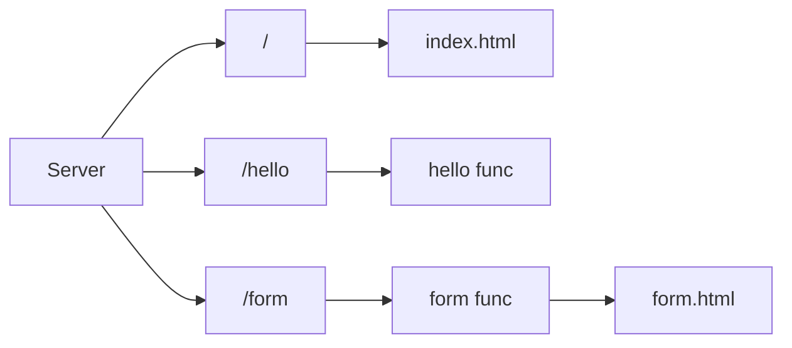

# Go Web Server

A simple web server written in Go that serves static files and handles basic form submissions.

## Architecture

The server routes incoming requests as follows::



*(If you save the attached image as `architecture.png` in this folder, it will also display below)*


## Getting Started

### Prerequisites
- [Go](https://golang.org/doc/install) installed on your machine.

### Running the server

1. Open your terminal in the project directory.
2. Run the server:
   ```bash
   go run main.go
   ```
3. The server will start on port `8080`.

### Routes

- **`GET /`** - Serves the `index.html` static file.
- **`GET /hello`** - A simple route returning a "Hello World!" message.
- **`GET /form`** - Serves the `forms.html` file where you can fill out your details.
- **`POST /form`** - Processes the submitted form data and displays it back to you.
